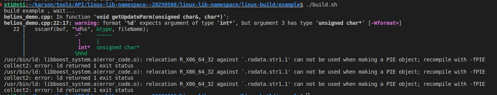
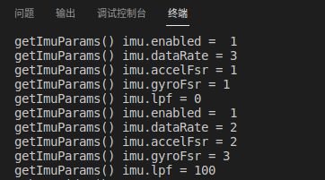
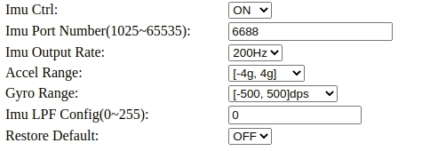
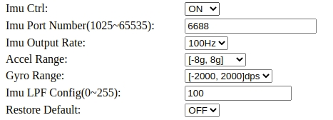
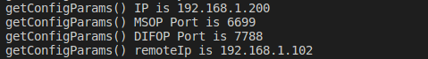
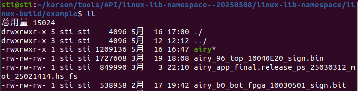
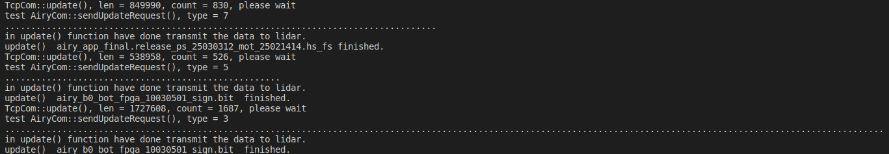
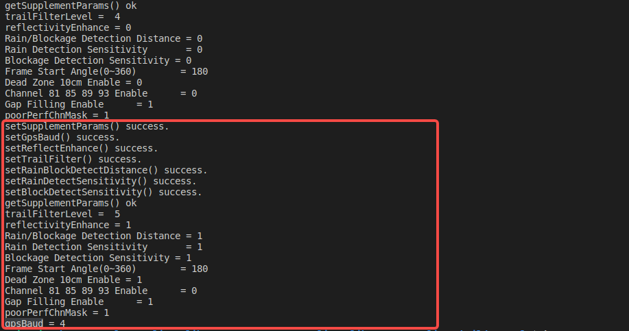

# Airy API

## CMake and Build

### Demo Lib Example

```bash
user@user:~$ cd example
user@user:~/example$ ./build.sh
user@user:~/example$ ./airy3
```

If it pops an error like this:



It is caused by an Ubuntu version mismatch. The solution is as follows:

1. Copy the package to any directory of Ubuntu 20.04.
2. Go to `linux-lib-namespace/linux-build` and execute `./linux-build-lib.sh`, then go to `example` and execute `./build.sh`.

## Example of Configuration Changes (using Airy as reference)

### IMU Parameter Acquisition / Modification

```cpp
// Initialize and get imu parameters
ImuParam imu;
pCtrl->getImuParams(imu);
printf("getImuParams() imu.enabled =  %d\n", imu.enabled);
printf("getImuParams() imu.dataRate = %d\n", imu.dataRate);
printf("getImuParams() imu.accelFsr = %d\n", imu.accelFsr);
printf("getImuParams() imu.gyroFsr = %d\n",  imu.gyroFsr);
printf("getImuParams() imu.lpf = %d\n",  imu.lpf);

// Modify the imu parameter and write
imu.enabled  = 1;
imu.dataRate = 2;
imu.accelFsr = 2;
imu.gyroFsr  = 3;
imu.lpf = 100;
pCtrl->setImuParams(imu);
sleep(1);
memset(&imu, 0, sizeof(imu));
pCtrl->getImuParams(imu);
printf("getImuParams() imu.enabled =  %d\n", imu.enabled);
printf("getImuParams() imu.dataRate = %d\n", imu.dataRate);
printf("getImuParams() imu.accelFsr = %d\n", imu.accelFsr);
printf("getImuParams() imu.gyroFsr = %d\n",  imu.gyroFsr);
printf("getImuParams() imu.lpf = %d\n",  imu.lpf);
```

:::note
You need to get the IMU parameters first and modify the corresponding values before writing back.
:::

The result of the terminal run shows:



|  | Before | After |
|---|---|---|
| IMU parameter modification |  |  |

**ImuParam Definition**

```cpp
typedef struct ImuParam
{
    u8  enabled;     //  0 -- disabled, 1 -- enabled
    u8  dataRate;    //  0 -- 25Hz, 1 -- 50Hz, 2 -- 100Hz, 3 -- 200Hz, 4 -- 1000Hz
    u8  accelFsr;    //  0 -- [-2g, 2g], 1 -- [-4g, 4g], 2 -- [-8g, 8g], 3 -- [-16g, 16g]
    u8  gyroFsr;     //  0 -- [-250, 250] dps, 1 -- [-500, 500] dps, 2 -- [-1000, 1000] dps, 3 -- [-2000, 2000] dps
    u16 udpPort;     //  [1024, 65535]
    u16 vlanID;      //  [0, 7]
    u16 vlanPrio;    //  [0, 4094]
    u8  calibStatus; //  0 not calib; 1 is calibed
    u8  lpf;         //  [0, 255] Low pass filter
    u8  resv[8];
} ImuParam_st;
```

### Network Parameter Acquisition / Modification

1. Network parameter acquisition and printing:

```cpp
ConfigPara params;
pCtrl->getConfigParams(params);

printf("getConfigParams() IP is %d.%d.%d.%d\n", params.r4info.netInfo.ip[0], params.r4info.netInfo.ip[1],
    params.r4info.netInfo.ip[2], params.r4info.netInfo.ip[3]);
printf("getConfigParams() MSOP Port is %d\n", params.r4info.netInfo.msopPort);
printf("getConfigParams() DIFOP Port is %d\n", params.r4info.netInfo.difopPort);
printf("getConfigParams() remoteIp is %d.%d.%d.%d\n", params.r4info.netInfo.remoteIp[0], params.r4info.netInfo.remoteIp[1],
    params.r4info.netInfo.remoteIp[2], params.r4info.netInfo.remoteIp[3]);
```



2. Modification of network parameters:

```cpp
NetParam_st net_params = params.r4info.netInfo;
uint8_t device_ip[4] = {192, 168, 1, 201};  // new Lidar IP
uint8_t gateway[4] = {192, 168, 1, 1};       // new Gateway
uint8_t dest_ip[4] = {192, 168, 1, 101};     // new Destination IP

memcpy(net_params.ip, device_ip, 4);
memcpy(net_params.gateway, gateway, 4);
memcpy(net_params.remoteIp, dest_ip, 4);

net_params.msopPort = 6699;                 // New MSOP port number that cannot conflict with other ports
net_params.difopPort = 7788;                // New DIFOP port number that cannot conflict with other ports

printf("setConfigParams() IP is %d.%d.%d.%d\n", net_params.ip[0], net_params.ip[1],
    net_params.ip[2], net_params.ip[3]);
printf("setConfigParams() MSOP Port is %d\n", net_params.msopPort);
printf("setConfigParams() DIFOP Port is %d\n", net_params.difopPort);
printf("setConfigParams() remoteIp is %d.%d.%d.%d\n", net_params.remoteIp[0], net_params.remoteIp[1],
    net_params.remoteIp[2], net_params.remoteIp[3]);

rst = pCtrl->setLidarNetInfo(net_params);   // Send new parameters to the Lidar
printf("setConfigParams() rst = %d\n", (int)rst);
```

### Firmware Update

Firmware files need to be in the same path as the demo application.



**File Naming Rules**

```text
Airy uses 3 update files: 3, 5, 7. File name needs to begin with "airy".
NET_CMD_TOP_BIN_UPDATE,   "airy_xx_top_xxxxxxxx_sign.bin"
NET_CMD_BOT_BIN_UPDATE,   "airy_b1_bot_fpga_xxxxxxxx_sign.bit"
NET_CMD_LINUX_APP_UPDATE, "airy_app_final.release_ps_xxx_mot_xxx.appimage.hs_fs"
```

**Demo Code**

```cpp
unsigned char type = 0;
type = 0;
char fileName[255] = {"airy_app_final.release_ps_25030312_mot_25021414.hs_fs"};
bool rst = pCtrl->update(NET_CMD_LINUX_APP_UPDATE, fileName);
if(!rst)
{
    printf("update %s failed.\n", fileName);
    return -1;
}
else
{
    printf("update()  %s finished.\n", fileName);
}

char fileName2[255] = {"airy_b0_bot_fpga_10030501_sign.bit"};
rst = pCtrl->update(NET_CMD_BOT_BIN_UPDATE, fileName2);
if(!rst)
{
    printf("update %s failed.\n", fileName2);
    return -1;
}
printf("update()  %s  finished.\n", fileName2);

char fileName3[255] = {"airy_96_top_10040E20_sign.bin"};
rst = pCtrl->update(NET_CMD_TOP_BIN_UPDATE, fileName3);
if(!rst)
{
    printf("update %s failed.\n", fileName3);
    return -1;
}
printf("update()  %s  finished.\n", fileName3);
```

**Result**



### Advanced Parameter Acquisition / Setting

This function can read and modify the following parameters:

- Frame Start Angle
- topCh81858393En
- deadZone10cmEn
- gapFilling
- trailFilterLevel
- reflectivityEnhance
- Rain / Blockage Detection Distance
- Rain Detection Sensitivity
- Blockage Detection Sensitivity
- gpsBaud

**Get Parameters**

```cpp
NetInfo2_st get_suparam;
rst = pCtrl->getSupplementParams(get_suparam);
if(rst)
{
    printf("getSupplementParams() ok\n");
    printf("trailFilterLevel =  %d\n", get_suparam.trailFilterLevel);            // [1, 7]
    printf("reflectivityEnhance = %d\n", get_suparam.reflectivityEnhance);       // 0:off  1:on1  2:on2  3:on3
    printf("Rain/Blockage Detection Distance = %d\n", get_suparam.rainDist);     // [0,3]  0:30cm  1:20cm  2:10cm
    printf("Rain Detection Sensitivity   = %d\n",  get_suparam.rainSensitivity); // [0,2]  0:high  1:middle  2:low
    printf("Blockage Detection Sensitivity = %d\n",  get_suparam.blockSensitivity); // [0,2]  0:high  1:middle  2:low
    printf("Frame Start Angle(0~360)    = %d\n",  get_suparam.u16FrameStartAngle);  // [0,360]
    printf("Dead Zone 10cm Enable = %d\n",  get_suparam.deadZone10cmEn);         // [0,1]  0:on  1:off
    printf("Channel 81 85 89 93 Enable  = %d\n",  get_suparam.topCh81858393En);  // [0,1]  0:off  1:on
    printf("Gap Filling Enable  = %d\n",  get_suparam.gapFilling);               // [0,1]  0:off  1:on
}
else
{
    printf("getSupplementParams() failed.\n");
}
```

**Modify Parameters**

```cpp
set_suparam.ptpNum = get_suparam.ptpNum;
set_suparam.msopVlanId = get_suparam.msopVlanId;
set_suparam.msopVlanPrio = get_suparam.msopVlanPrio;
set_suparam.difopVlanId = get_suparam.difopVlanId;
set_suparam.difopVlanPrio = get_suparam.difopVlanPrio;
set_suparam.ptpVlanId = get_suparam.ptpVlanId;
set_suparam.ptpVlanPrio = get_suparam.ptpVlanPrio;
set_suparam.respToPdelay = get_suparam.respToPdelay;
set_suparam.noLeepSecond = get_suparam.noLeepSecond;
set_suparam.syncTimeoutVal = get_suparam.syncTimeoutVal;
set_suparam.unlockToLockTime = get_suparam.unlockToLockTime;
set_suparam.lockToUnlockTime = get_suparam.lockToUnlockTime;
set_suparam.triggerMode = get_suparam.trailFilterLevel;
set_suparam.enableAngleWave = get_suparam.enableAngleWave;
set_suparam.startAngle = get_suparam.startAngle;
set_suparam.angleStep = get_suparam.angleStep;
set_suparam.angleWaveWidth = get_suparam.angleWaveWidth;
set_suparam.webCfgVer = get_suparam.webCfgVer;
set_suparam.u16FrameStartAngle = get_suparam.u16FrameStartAngle;
set_suparam.machineSlideEn = get_suparam.machineSlideEn;
set_suparam.deadZone10cmEn = get_suparam.deadZone10cmEn;
set_suparam.topCh81858393En = get_suparam.topCh81858393En;
set_suparam.poorPerfChnMask = get_suparam.poorPerfChnMask;
set_suparam.gapFilling = get_suparam.gapFilling;
set_suparam.msopPort1 = get_suparam.msopPort1;

set_suparam.u16FrameStartAngle  = 180; // set frame start angle
set_suparam.topCh81858393En = 1;
set_suparam.gapFilling  = 1;           // [0,1] 0:OFF  1:ON
set_suparam.deadZone10cmEn = 1;
memset(set_suparam.resv, 0, sizeof(set_suparam.resv));
rst = pCtrl->setSomeSupplementParams(set_suparam);
if(rst)
{
    printf("setSupplementParams() success.\n");
}
else
{
    printf("setSupplementParams() failed.\n");
}
sleep(1);

// GPS baud rate setting
rst = pCtrl->setGpsBaud(0x04);
if(rst) { printf("setGpsBaud() success.\n"); }
else    { printf("setGpsBaud() failed.\n"); }

// Reflectance Enhancement Settings // 0:off  1:on1  2:on2  3:on3
rst = pCtrl->setReflectEnhance(1);
if(rst) { printf("setReflectEnhance() success.\n"); }
else    { printf("setReflectEnhance() failed.\n"); }

// TrailFilter settings // [1, 7]
rst = pCtrl->setTrailFilter(5);
if(rst) { printf("setTrailFilter() success.\n"); }
else    { printf("setTrailFilter() failed.\n"); }

// RainBlockDetectDistance settings // [0,3] 0:30cm 1:20cm 2:10cm
rst = pCtrl->setRainBlockDetectDistance(1);
if(rst) { printf("setRainBlockDetectDistance() success.\n"); }
else    { printf("setRainBlockDetectDistance() failed.\n"); }

// RainDetectSensitivity settings // [0,2] 0:high 1:middle 2:low
rst = pCtrl->setRainDetectSensitivity(1);
if(rst) { printf("setRainDetectSensitivity() success.\n"); }
else    { printf("setRainDetectSensitivity() failed.\n"); }

// BlockDetectSensitivity // [0,2] 0:high 1:middle 2:low
rst = pCtrl->setBlockDetectSensitivity(1);
if(rst) { printf("setBlockDetectSensitivity() success.\n"); }
else    { printf("setBlockDetectSensitivity() failed.\n"); }
```

**Results**


