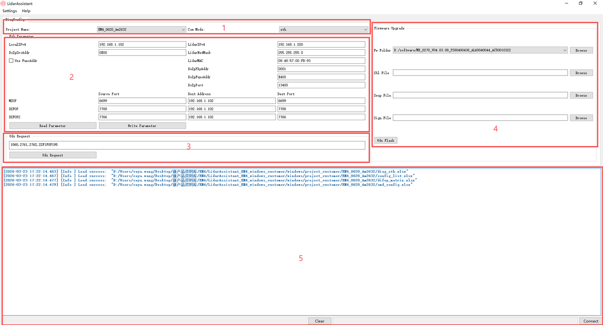
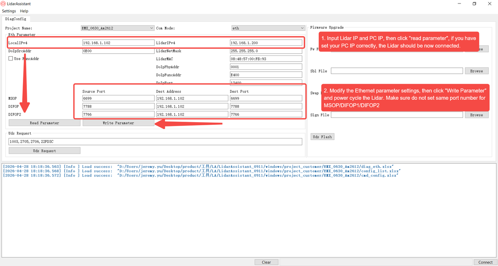
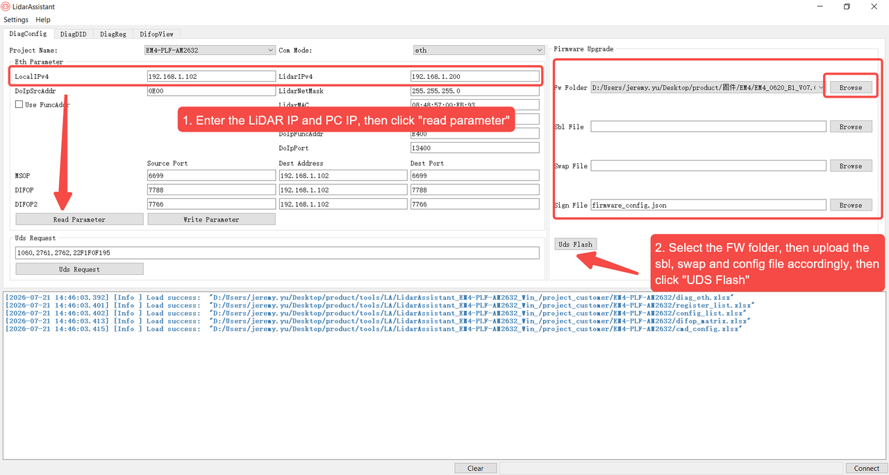

# EM Platform LidarAssistant Tool

## 1. Connect the LiDAR

1. LiDAR has completed physical connection with the computer (harness, network cable, and power cable are connected properly), and the device is powered on and starts up normally.
2. Configure the computer's local IP Address to be on the same network segment as the LiDAR (factory default LiDAR IP: `192.168.1.200`, computer is recommended to be configured as `192.168.1.102`, subnet mask `255.255.255.0`).
3. Turn off the computer firewall and other security software that may block network communication.

## 2. Introduction to the Tool Interface Area

### Area 1: Project Selection Area

- **Project Name**: EM4/EMX
- **Com Channel**: Ethernet communication mode

### Area 2: LiDAR Connection Parameter Configuration Area

- **Local IPv4**: Computer IP Address, the corresponding IP Address needs to be configured in the computer's network card.
- **LidarIPv4**: LiDAR IP Address.
- **DoIpSrcAddr**: DoIp Source IP Address.
- **LidarNetMask**: Subnet mask of the LiDAR IP address.
- **DoIpPhyAddr**: Target Physical Address (Hex).
- **DoIpFuncAddr**: Target Functional Address (Hex).
- **DoIpPort**: DoIp Port.
- **MsopNetData**: Source Port (Decimal), Destination Address, Destination Port (Decimal).
- **DifopNetData**: Source Port (Decimal), Destination Address, Destination Port (Decimal).
- **Read Parameter**: Read all network parameters.
- **Write Parameter**: Write all network parameters.

### Area 3: UDS Request Area

- **UDS Request**: Send a UDS request message.

### Area 4: Firmware Upgrade Area

- **Fw Folder**: Firmware file path. After selecting the firmware folder, the software will automatically match the Sbl File, Swap File, and Sign File according to the Regular Expression configured in FwExp in `/project/cmd_config.xlsx`.
- **Sbl File**: sbl file path.
- **Swap File**: The path of the swap file.
- **Sign File**: Signature file path.
- Clicking the **Uds Flash** button will upgrade the firmware under the corresponding path to the LiDAR.

### Area 5: Log Output Area

- **Clear**: Clear the log display area.
- **Connect/Disconnect**: Establish/Disconnect connection with LiDAR.

## 3. Modify IP Parameters

## 4. Firmware Upgrade

## 5. Precautions

1. The port numbers of MSOP, DIFOP, and DIFOP2 all range from 1025 to 65535 and cannot be set to the same value to avoid port conflicts.
2. LocalIPv4 and LidarIPv4 must be in the same network segment; otherwise, it will cause the device to fail to connect properly.
3. After modifying the LiDAR parameters using the tool, the LiDAR needs to be powered off and restarted for the parameters to take effect.
4. If there is no read or write operation within 60 seconds, the tool automatically disconnects; click **Connect** again to reconnect.
