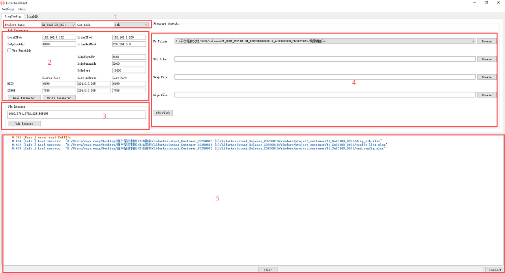
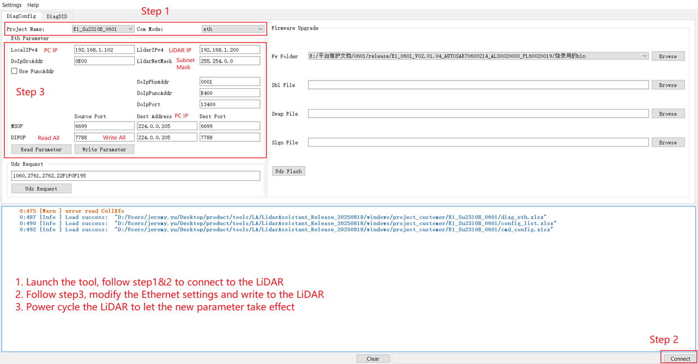
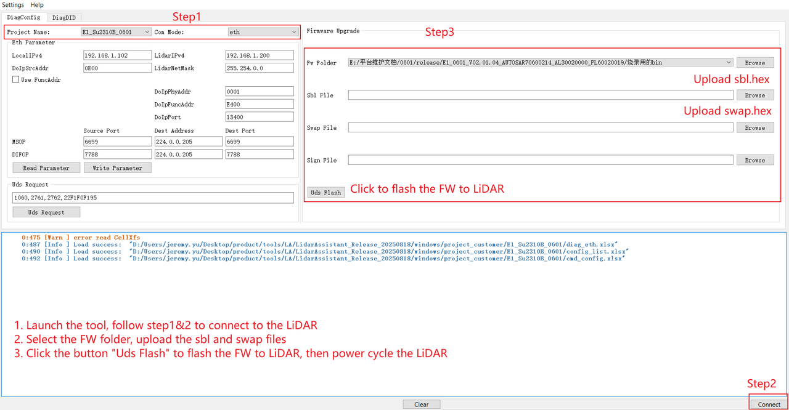

# E Platform

## 1. Connect to the LiDAR

1. Complete the physical connection between the LiDAR and the computer (the aviation plug cable, network cable and power are properly connected), then power on the device and let it start up normally.
2. Configure the local IP of the computer to be in the same subnet as the LiDAR (factory default LiDAR IP: `192.168.1.200`, recommended computer configuration: `192.168.1.102`, subnet mask: `255.255.255.0`).
3. Disable the computer firewall and other security software that may block network communication.

## 2. Introduction to Tool Interface Areas

### Area 1: Project Selection Area

- **Project Name**: E1
- **Com Mode**: Ethernet communication mode

### Area 2: LiDAR Connection Parameter Configuration Area

- **LocalIPv4**: PC IP Address. The corresponding IP Address needs to be configured in the PC's network adapter.
- **LidarIPv4**: LiDAR IP Address.
- **DoIpSrcAddr**: DoIp Source Address.
- **LidarNetMask**: Subnet mask of the LiDAR IP.
- **DoIpPhyAddr**: Target Physical Address (Hex).
- **DoIpFuncAddr**: Target functional address (Hex).
- **DoIpPort**: DoIp port.
- **MsopNetData**: Source port (decimal), destination address, destination port (decimal).
- **DifopNetData**: Source port (decimal), destination address, destination port (decimal).
- **Read Parameters**: Read all network parameters.
- **Write Parameter**: Write all network parameters.

### Area 3: UDS Request Area

- **UDS Request**: Send the UDS request message.

### Area 4: Firmware Upgrade Area

- **Fw Folder**: Firmware file path. After selecting the firmware folder, the software will automatically match the Sbl File, Swap File, and Sign File according to the Regular Expression configured in FwExp within `/project/cmd_config.xlsx`.
- **Sbl File**: Path of the sbl file.
- **Swap File**: Path of the swap file.
- **Sign File**: Path of the signature file.
- Clicking the **UDS Flash** button will upgrade the firmware in the corresponding path to the LiDAR.

### Area 5: Log Output Area

- **Clear**: Clear the log display area.
- **Connect/Disconnect**: Establish/terminate connection with the LiDAR.

## 3. Modify IP Parameters

## 4. Firmware Upgrade

## 5. DID Service

**Interface Function Overview**: Supports read and write operations for DID. This view contains the DIDs commonly used in this project; click **Read** and **Write** to perform corresponding read and write operations, and the read and write data will be displayed in the edit box on the right.

## 6. Precautions

1. The values of the two Port Numbers, MSOP and DIFOP, both range from 1025 to 65535, and they cannot be set to the same value to avoid port conflicts.
2. LocalIPv4 and LidarIPv4 must be in the same network segment; otherwise, the device will fail to connect properly.
3. After modifying the LiDAR parameters with the tool, the LiDAR must be powered off and restarted for the parameters to take effect.
