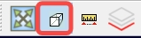
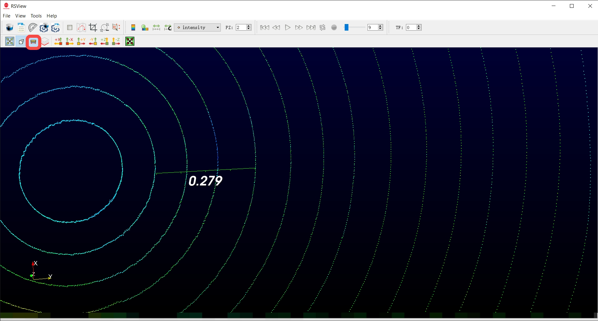
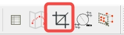
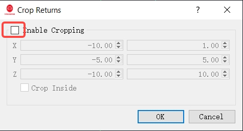
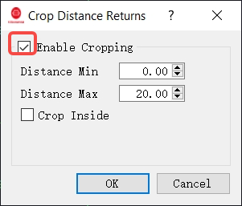
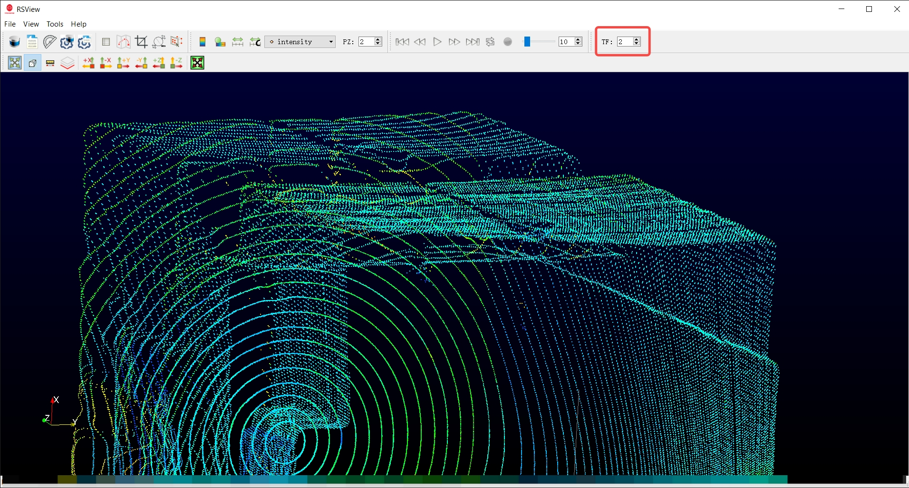
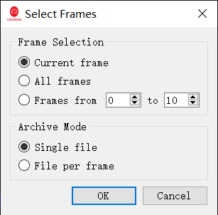

# Advance Operations
This section introduces advanced usage of RSView, including distance measurement, point cloud cropping, frame stacking, and more.

---

## Distance Measurement
First, click this button to switch the point cloud to an **orthographic view** (the default is **perspective view**).

Then, select the distance measurement tool, and hold the left mouse button while dragging to measure the distance in the point cloud.

---

## Pointcloud cropping
You can crop the point cloud according to the coordinates of the points with the menu item **View-> Crop Returns**.

In the dialog box that is opened, you can specify a rectangle in which the points outside this rectangle are not displayed. If **Crop Inside** is selected, the points inside this rectangle are not displayed.

You can also crop the point cloud by distance, first click the item **View-> Crop Distance Returns**.

Then in the pop up dialog, you can specify the min and max distance, points outside this distance range will not be displayed.

---
## Frame Stacking
This feature is only useful when parsing PCAP files and is invalid when connecting to an online LiDAR.

RSView supports stacked display of consecutive multi-frame point clouds. The following toolbar item TF allows you to set the number of frames to be followed.

In the example below, if the TF option is 2, the current 1 frame point cloud and the following 2 frames are displayed, for a total of 3 frames.

---
## Export Pointcloud as Other Formats

### Export as CSV Format
Select the menu item **File -> Save As -> CSV** to export the specified frames to CSV format.

### Export as PCD Format
Select the menu item File -> Save As -> PCD to export the specified frames to the PCD format.

The following dialog allows you to select which frames to export.

