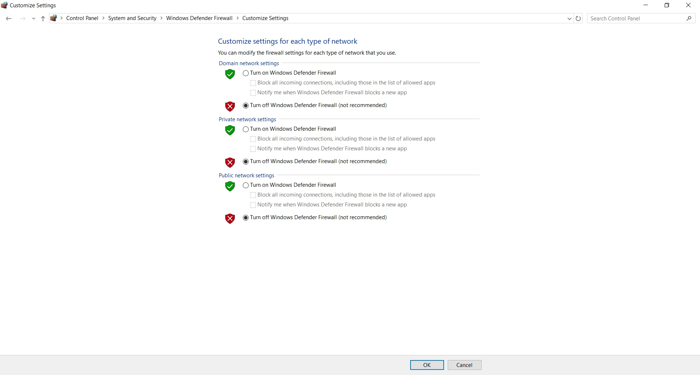
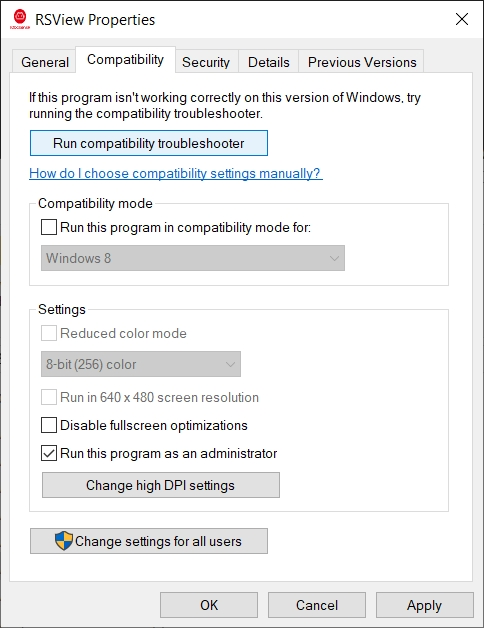

# FAQ
Here are some common usage issues. If you encounter them, you can troubleshoot them on your own.

## Q1: Cannot Launch RSView
Make sure the firewall of your device is **turned off**.

---
## Q2: Error Message "No module named rsview"
Check whether the program path contains **invalid characters**. The RSView program path must not contain any invalid characters and does not support Chinese characters. It is recommended to use a file path composed of English letters and numbers only.

---
## Q3: Fail to Play/Load Pointcloud
Check whether the user running RSView has **administrator privileges** on the current computer. It is recommended to run the program with administrator privileges.

---
## Q4: Program Crashed When Reading Pcap File
Check whether the data packet path contains **invalid characters**. The PCAP file name and path read by RSView must not contain any invalid characters and do not support Chinese characters. It is recommended to use file names and paths composed of English letters and numbers only.

---
### Q5: No Pointcloud is Displayed
1. Check if the LiDAR harnesses&accessories are connected properly
2. Check whether the LiDAR model and port configuration in RSView are correct. In the Wireshark capture interface, check the Info column. The default MSOP port is **6699**, and the default DIFOP port is **7788**. Under normal operation, the number of MSOP packets should be greater than DIFOP packets. You can roughly verify this by packet count, or use filter expressions in Wireshark to filter and view the corresponding ports.
    - Note: for EM series, the default DIFOP port is **7766**
3. Check whether two instances of RSView are running. If two instances are opened at the same time, port conflicts may occur, which can prevent the second RSView instance from displaying point clouds correctly.

---
## Q6: Windows DLL System Error

Please contact Robosense technical support for the **dependency packet**, then copy all files in the packet to C://Windows/System32

---
## Q7: Fail to Save PCD When Playing Online Pointcloud

Real-time online data does not support saving in .pcd format. You need to first capture a .pcap file using Wireshark, then play the .pcap file in RSView. Fast-forward to the desired frame position and save it as a .pcd file (make sure to pause playback before saving the .pcap file).
