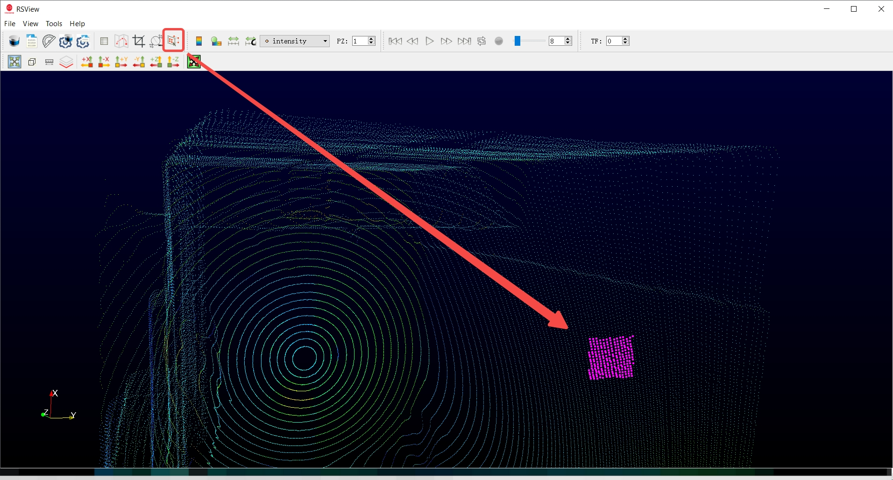
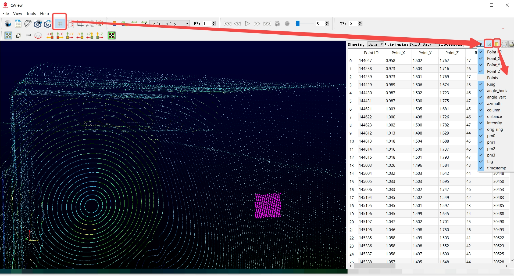
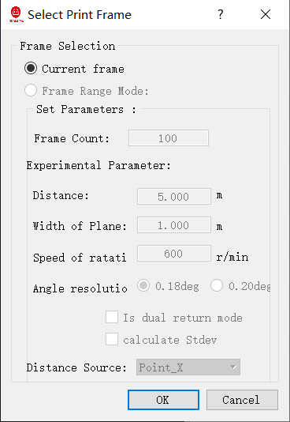
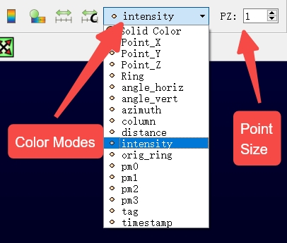

# Point Cloud Interaction

This section introduces how to interact with point cloud data in RSView, including navigation, selection, and visualization controls.

---

## Navigation Controls

RSView supports standard 3D navigation using mouse operations.

### Rotate View
- **Left mouse button + drag**
- Rotate the point cloud in 3D space

### Pan View
- **Mouse middle button (scroll wheel) + drag**
- Move the scene horizontally and vertically

### Zoom
- **Mouse scroll wheel**
- Zoom in or out of the point cloud

---

## View Control

### Reset View
Restore the default LiDAR forward-facing view using the reset button.

### Preset Views
RSView provides several predefined perspectives:

- Front View
- Top View
- Side View

These views help inspect geometry from different angles quickly.

---

## Point Selection

You can select points with the points selection tool.

### Select a Point
- Click the point selection tool
- Left mouse button + drag to select a portion of the pointcloud
- Selected points will be highlighted

Selected points can be inspected in the data table.

---

## Point Attributes

After a group of points is selected, you can check the point attributes by clicking the spreadsheet button.

Each point contains multiple attributes, you can toggle the visibility of each field:

- X, Y, Z (position)
- Intensity
- Ring (laser channel index)
- Timestamp

These attributes can be used for detailed analysis and debugging.

---

## Export Selected Points
The toolbar item below will save the current point cloud frame to a CSV file.

The opened dialog box is as follows.

Click OK and select the path to the CSV file.

---

## Visualization Settings

### Point Size
Adjust point size to improve visibility in dense scenes.

### Color Modes
RSView supports multiple coloring modes:

- Intensity (default)
- Distance
- Height (Z-axis)
- Timestamp

Switching color modes helps highlight different spatial features.

---

## Grid Display

A reference grid is available to help estimate scale and distance.

- Each grid cell represents a fixed spatial unit
- Useful for object size estimation and scene understanding

You can toggle the grid in:
View → Measurement Grid

