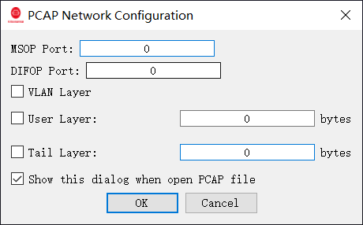

# Quick Start

RSView is a visualization and analysis tool for RoboSense LiDAR point cloud data. It supports both online LiDAR devices and offline PCAP file playback.

## Prerequisites

Before viewing point cloud data, make sure:

* RSView is installed
* The LiDAR is powered on and connected to the network
* The PC network configuration matches the LiDAR network segment

## Step 1: Select data source

### Open Online LiDAR

Click **Open Sensor** to connect to a live LiDAR.

### Open PCAP File

Click **Open PCAP File** and select the recorded file.

## Step 2: Select LiDAR Type

1. Click **File → Sensor Type and Configuration**
2. Select the LiDAR model from the **Sensor Type** drop-down list
3. Optionally load an external calibration file

## Step 3: Configure Network Options

### Online LiDAR

Configure:

* MSOP Port
* DIFOP Port
* Host IP (for multicast mode)
* Group IP (for multicast mode)

### PCAP File

For offline PCAP playback:

* Leave ports as 0 when the file contains data from a single LiDAR
* Specify ports when multiple LiDAR streams exist in the same PCAP file

## Next Steps

* Point Cloud Visualization
* Point Cloud Analysis
* Export Point Cloud Data
* Playback Controls
