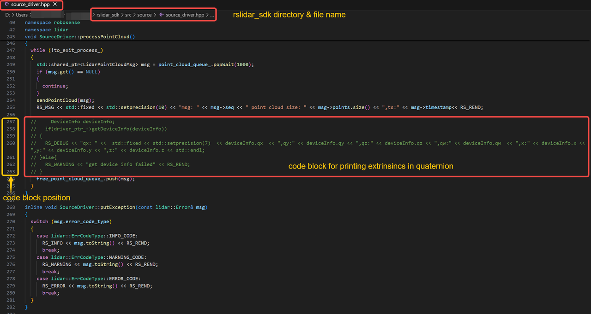

# IMU Extrinsic Parameters Instructions

## Direct read from rslidar_sdk (Temporarily for Airy/Fairy ONLY)

- The below commented code block is able to print the quaternion of Airy/Fairy IMU extrinsics in the terminal when the driver is running.
- After uncommenting this part, users need to remake/rebuild the driver for it to take effect.



- This will print the qx, qy, qz, qw quaternions, and xyz in the terminal.


- If all values return to be 0, that means this LiDAR device has not been registered with IMU parameters (early samples). Please contact RoboSense in case of this situation.
- Quaternions correspond to `extrinsic_Q`, while xyz correspond to `extrinsic_T`. `extrinsic_R` needs to be all 0 for quaternions to work. In the `.yaml` file in SLAM algorithms, they should look like:

```yaml
extrinsic_Q: [qx,qy,qz,qw]      # quaternions - qx,qy,qz,qw (effect w/o rotation matrix)
extrinsic_T: [x,y,z]            # translation matrix
extrinsic_R: [0,0,0,            # rotation matrix
              0,0,0,
              0,0,0]
```

In RoboSense rslidar_sdk [**release v1.5.19**](https://github.com/RoboSense-LiDAR/rslidar_sdk/releases/tag/v1.5.17), this code block has been removed as this is only a developer code.

Therefore we attached the codes here for users to copy and paste easily:

```cpp
//   DeviceInfo deviceInfo;
  //   if(driver_ptr_->getDeviceInfo(deviceInfo))
  // {
  //   RS_DEBUG << "qx: " <<  std::fixed << std::setprecision(7)  << deviceInfo.qx  << ",qy:" << deviceInfo.qy << ",qz:" << deviceInfo.qz << ",qw:" << deviceInfo.qw  << ",x:" << deviceInfo.x << ",y:" << deviceInfo.y << ",z:" << deviceInfo.z << std::endl;
  // }else{
  //   RS_WARNING << "get device info failed" << RS_REND;
  // }
```


## Additional information

1. If users prefer to use traditional `extrinsic_T` and `extrinsic_R` instead of quaternions, please use proper conversion tools.

2. **Why is the angular_velocity value not 0 when the LiDAR is stationary?**

    **Answer:** Because of temperature, noise, installation errors and even the rotation of the earth, the IMU will generate a certain angular velocity when stationary, so we will make up for the zero bias error, our algorithms will be automatically corrected to ensure the accuracy of the IMU data. This value is currently non-zero, but it is very close to 0 because there is still some unknown tiny noise that can't be fully corrected, and thus the value can only be close to 0, but not exactly 0 for all angular velocity values.

3. **Why is there a large z value of imu (around -10 ~ -9) when the LiDAR is stationary?**

    **Answer:** When stationary, IMU acceleration is equivalent to the acceleration of gravity. In reality, accelerometers measure the acceleration of the object itself, and the nature of the output at rest is the equivalent acceleration (in the direction of the supporting force) needed to counteract the force of gravity. Due to the direction of the force and earth latitudes, it is not exactly equivalent to 9.8.
