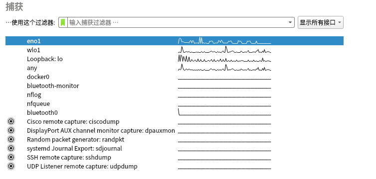
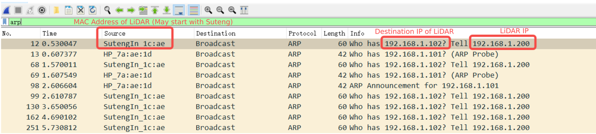
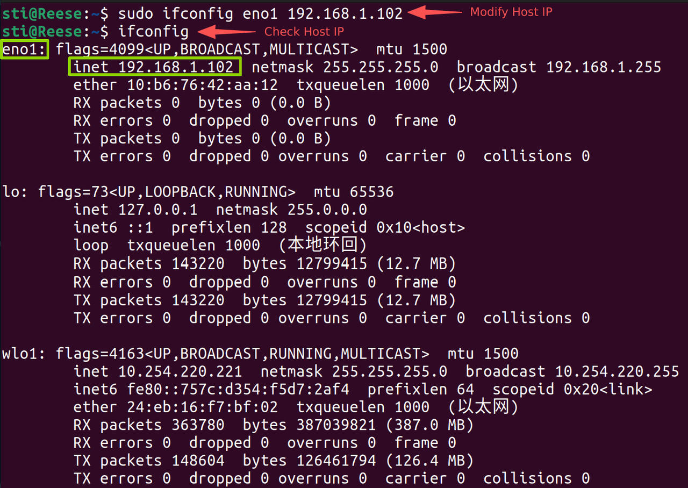
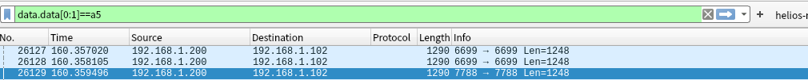

# rslidar_sdk User Guide

This guide walks through the environment dependencies, compilation, LiDAR connection, and parameter configuration required to run `rslidar_sdk`.

---

## Environment Dependencies

### ROS

To use the SDK in a ROS environment, the ROS dependency libraries need to be installed.

| Ubuntu Version | ROS Distribution |
| --- | --- |
| Ubuntu 16.04 | ROS Kinetic desktop |
| Ubuntu 18.04 | ROS Melodic desktop |
| Ubuntu 20.04 | ROS Noetic desktop |

For installation instructions, refer to: [ROS Installation](http://wiki.ros.org).

### ROS2

To use the SDK in a ROS2 environment, the ROS2 dependency libraries need to be installed.

| Ubuntu Version | ROS2 Distribution |
| --- | --- |
| Ubuntu 18.04 | ROS2 Eloquent desktop |
| Ubuntu 20.04 | ROS2 Galactic desktop |
| Ubuntu 22.04 | ROS2 Humble desktop |

For installation instructions, refer to: [ROS2 Installation](https://docs.ros.org/en/humble/Installation.html).

### yaml

The installed dependency package must meet **version ≥ v0.5.2**. If **ROS desktop-full** is already installed, this step can be skipped. The installation command is as follows:

```shell-session
user@user:~$ sudo apt-get update
user@user:~$ sudo apt-get install -y libyaml-cpp-dev
```

### libpcap

The installed dependency package must meet **version ≥ v1.7.4**. The installation command is as follows:

```shell-session
user@user:~$ sudo apt-get update
user@user:~$ sudo apt-get install -y libpcap-dev
```

### Notes

1. It is recommended to install the **ROS desktop-full** version. This installation process will automatically install compatible versions of dependency libraries (e.g., PCL). This avoids issues such as missing necessary dependencies or spending significant time on independent installations.
2. **Ubuntu 22.04** no longer supports ROS. Therefore, on this system version, users can compile by executing the following command:

   ```shell-session
   user@user:~$ echo "deb [trusted=yes arch=amd64] http://deb.repo.autolabor.com.cn jammy main" | sudo tee /etc/apt/sources.list.d/autolabor.list
   user@user:~$ sudo apt update
   user@user:~$ sudo apt install ros-noetic-autolabor
   ```

   or use ROS2 (suggested).
3. **Please do not install both ROS and ROS2 on the same computer.**
4. **Ubuntu 24.04** has been tested to support `rslidar_sdk` based on ROS2, but Ubuntu 22.04 or earlier versions are still recommended.
5. All third-party libraries that `rslidar_sdk` depends on provide versions supported under the ARM architecture, allowing compilation, installation, and usage on ARM.

---

## Compilation and Run

### Obtaining the project files

It is recommended to use the `git` command to pull the project files directly from the GitHub repository to ensure the timeliness and completeness of the project version.

```shell-session
user@user:~/workspace$ git clone https://github.com/RoboSense-LiDAR/rslidar_sdk.git
user@user:~/workspace$ cd rslidar_sdk
user@user:~/workspace$ git submodule init
user@user:~/workspace$ git submodule update
```

In addition to the above method, users can directly visit the [Official Repository](https://github.com/RoboSense-LiDAR/rslidar_sdk/releases) to download the latest version of the software package `rslidar_sdk.tar.gz`.

> **Note:** Downloading the Source Code directly will result in a missing submodule `rs_driver`, leading to compilation and installation failure.

### Compilation and run based on ROS

It is recommended to create a new folder in the home directory of the local machine as a workspace, and then create a `src` folder within that workspace. Place the pulled `rslidar_sdk` project files into the `src` folder: `~/workspace/src/rslidar_sdk`.

Return to the workspace directory (e.g., `~/workspace`) and execute the following commands to compile and install. Please ensure being in a ROS environment during execution.

```shell-session
user@user:~/workspace$ catkin_make
user@user:~/workspace$ source devel/setup.bash
user@user:~/workspace$ roslaunch rslidar_sdk start.launch
```

> **Note:** If using zsh, replace the second command with `source devel/setup.zsh`.

### Compilation and run based on ROS2

For compilation and installation based on ROS2, the `rslidar_msg` project files need to be additionally obtained to define the LiDAR packet messages in the ROS2 environment. The download link is: [rslidar_msg](https://github.com/RoboSense-LiDAR/rslidar_msg). After downloading, place it in the `src` folder, alongside the `rslidar_sdk` project files.

Return to the workspace directory (e.g., `~/workspace`) and execute the following commands to compile and run. Ensure that you are in a ROS2 environment during execution.

```shell-session
user@user:~/workspace$ colcon build
user@user:~/workspace$ source install/setup.bash
user@user:~/workspace$ ros2 launch rslidar_sdk start.py
```

> **Note:** If using zsh, replace the second command with `source install/setup.zsh`.

**Before running the SDK, first ensure that the LiDAR is connected correctly and the common parameters are entered correctly.**

---

## LiDAR Connection

Download and install **Wireshark** to view network port packets.

```shell-session
user@user:~$ sudo apt-get install wireshark
user@user:~$ sudo wireshark
```

Select the corresponding network interface card to view packet status. The common network interface card name under Ubuntu is `eno1` (**Figure 3.1**).



*Figure 3.1 — Home page options area of Wireshark*

Enter the capture interface of the corresponding network port. If no UDP data is visible, check the LiDAR ARP packets. Based on the content prompt (*Who has...*), modify the static IP of the host's network interface card to the destination IP of the LiDAR data.



*Figure 3.2 — Wireshark packet capture interface (ARP packets)*

Modify the host static address to the LiDAR destination address, and check whether the modified parameters take effect. An example of the modification command is as follows:

```shell-session
user@user:~$ sudo ifconfig eno1 192.168.1.102
user@user:~$ ifconfig
```



*Figure 3.3 — Modify and check host static address*

In the input box of the Wireshark capture interface, enter a command to view the MSOP/DIFOP/IMU port numbers of the LiDAR UDP data.

By default, the LiDAR MSOP port number is **6699**, the DIFOP port number is **7788**, and the IMU port number is **6688** (Airy/Fairy Only). Users can also filter and lock the MSOP/DIFOP/IMU data entries using the following commands.

```text
data.data[0:1] == 55     # Filter MSOP Data
data.data[0:1] == a5     # Filter DIFOP Data
data.data[0:1] == aa     # Filter IMU Data (Airy/Fairy Only)
```



*Figure 3.4 — Filtering only DIFOP data for the LiDAR based on the command*

---

## Parameter Configuration

Before starting the driver, users need to configure the correct `lidar_type`, `MSOP port`, and `DIFOP port` in the `src/rslidar_sdk/config/config.yaml` file. The port numbers can be obtained using the methods described above.

### Mechanical LiDAR

Mechanical LiDARs include the **RS series**, **Ruby series**, **Helios series**, **Bpearl series**, **Airy series**, **Fairy**, and other products.

The default port values are **6699** (MSOP) and **7788** (DIFOP), respectively.

> **Note:**
>
> 1. The Airy LiDAR additionally supports the acquisition of **IMU calibration data** (quaternions & offsets). For details, refer to the [FAQ](./faq.md).
> 2. For **AiryLite**, the `lidar_type` should be **RSAIRYLITE_ETH**.

### Non-mechanical LiDAR

Non-mechanical LiDARs include the **MEMS series**, **E series**, and **EM series**.

Regarding parameter configuration before starting the driver, non-mechanical LiDARs are essentially the same as mechanical LiDARs, but an additional note is needed:

> For **EM series** products, when filling in the DIFOP port number, the default parameter value is **7766** instead of 7788. A wrong DIFOP port number can lead to point cloud display failure.
