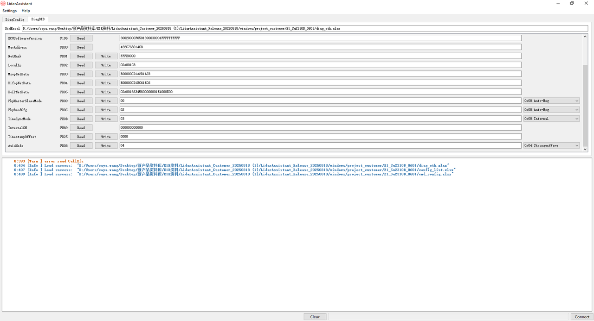

# E 平台

## 1. 连接激光雷达

1. 完成激光雷达与计算机之间的物理连接（航空插头线缆、网线与电源均正确连接），然后为设备上电并使其正常启动。
2. 将计算机的本地 IP 配置为与激光雷达处于同一子网（激光雷达出厂默认 IP：`192.168.1.200`，推荐计算机配置：`192.168.1.102`，子网掩码：`255.255.255.0`）。
3. 关闭计算机防火墙以及其他可能阻止网络通信的安全软件。

## 2. 工具界面区域介绍

### 区域 1：项目选择区

- **Project Name**：E1
- **Com Mode**：以太网通信模式

### 区域 2：激光雷达连接参数配置区

- **LocalIPv4**：PC 的 IP 地址。需要在 PC 的网络适配器中配置相应的 IP 地址。
- **LidarIPv4**：激光雷达的 IP 地址。
- **DoIpSrcAddr**：DoIp 源地址。
- **LidarNetMask**：激光雷达 IP 的子网掩码。
- **DoIpPhyAddr**：目标物理地址（十六进制）。
- **DoIpFuncAddr**：目标功能地址（十六进制）。
- **DoIpPort**：DoIp 端口。
- **MsopNetData**：源端口（十进制）、目标地址、目标端口（十进制）。
- **DifopNetData**：源端口（十进制）、目标地址、目标端口（十进制）。
- **Read Parameters**：读取所有网络参数。
- **Write Parameter**：写入所有网络参数。

### 区域 3：UDS 请求区

- **UDS Request**：发送 UDS 请求报文。

### 区域 4：固件升级区

- **Fw Folder**：固件文件路径。选择固件文件夹后，软件会根据 `/project/cmd_config.xlsx` 中 FwExp 配置的正则表达式，自动匹配 Sbl File、Swap File 和 Sign File。
- **Sbl File**：sbl 文件路径。
- **Swap File**：swap 文件路径。
- **Sign File**：签名文件路径。
- 点击 **UDS Flash** 按钮，将把相应路径下的固件升级到激光雷达。

### 区域 5：日志输出区

- **Clear**：清空日志显示区域。
- **Connect/Disconnect**：建立/断开与激光雷达的连接。

## 3. 修改 IP 参数

## 4. 固件升级

## 5. DID 服务

**界面功能概述**：支持对 DID 的读写操作。该视图包含本项目常用的 DID；点击 **Read** 和 **Write** 可执行相应的读写操作，读写数据将显示在右侧的编辑框中。

## 6. 注意事项

1. MSOP 和 DIFOP 这两个端口号的取值范围均为 1025 到 65535，且二者不能设置为相同的值，以避免端口冲突。
2. LocalIPv4 与 LidarIPv4 必须处于同一网段；否则设备将无法正常连接。
3. 使用工具修改激光雷达参数后，必须将激光雷达断电重启，参数才能生效。
