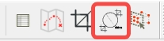
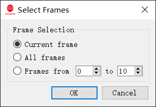

# 高级操作
本节介绍 RSView 的高级用法，包括距离测量、点云裁剪、帧叠加等。

---

## 距离测量
首先，点击此按钮将点云切换到**正交视图**（默认为**透视视图**）。

然后，选择距离测量工具，按住鼠标左键拖动即可在点云中测量距离。

---

## 点云裁剪
你可以通过菜单项 **View-> Crop Returns** 根据点的坐标对点云进行裁剪。

在打开的对话框中，你可以指定一个矩形区域，该矩形之外的点将不予显示。如果选中 **Crop Inside**，则该矩形之内的点将不予显示。

你也可以按距离裁剪点云，首先点击菜单项 **View-> Crop Distance Returns**。

然后在弹出的对话框中，你可以指定最小和最大距离，超出该距离范围的点将不予显示。

---
## 帧叠加
此功能仅在解析 PCAP 文件时有效，在连接在线 LiDAR 时无效。

RSView 支持连续多帧点云的叠加显示。以下工具栏项 TF 允许你设置需要跟随的帧数。

在下面的示例中，如果 TF 选项为 2，则会显示当前 1 帧点云以及后续 2 帧，总共 3 帧。

---
## 导出点云为其他格式

### 导出为 CSV 格式
选择菜单项 **File -> Save As -> CSV**，将指定帧导出为 CSV 格式。

### 导出为 PCD 格式
选择菜单项 File -> Save As -> PCD，将指定帧导出为 PCD 格式。

以下对话框允许你选择要导出的帧。

