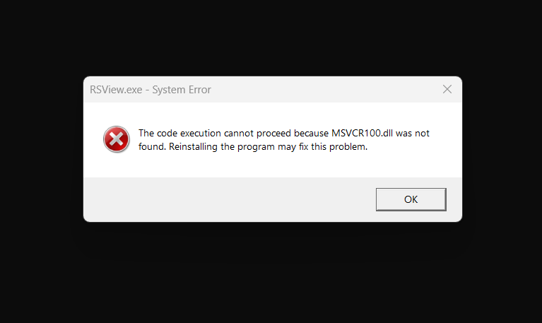
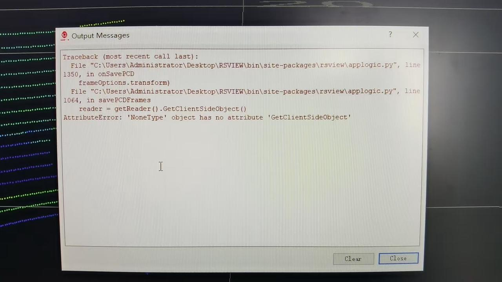

# 常见问题
以下是一些常见的使用问题。如果你遇到这些问题，可以自行排查。

## Q1：无法启动 RSView
请确保你设备的防火墙已**关闭**。

---
## Q2：错误提示 "No module named rsview"
检查程序路径中是否包含**无效字符**。RSView 程序路径不得包含任何无效字符，且不支持中文字符。建议使用仅由英文字母和数字组成的文件路径。

---
## Q3：无法播放/加载点云
检查运行 RSView 的用户在当前计算机上是否具有**管理员权限**。建议以管理员权限运行程序。

---
## Q4：读取 Pcap 文件时程序崩溃
检查数据包路径中是否包含**无效字符**。RSView 读取的 PCAP 文件名和路径不得包含任何无效字符，且不支持中文字符。建议使用仅由英文字母和数字组成的文件名和路径。

---
### Q5：不显示任何点云
1. 检查 LiDAR 线束及配件是否连接正常
2. 检查 RSView 中的 LiDAR 型号和端口配置是否正确。在 Wireshark 抓包界面中，查看 Info 列。默认 MSOP 端口为 **6699**，默认 DIFOP 端口为 **7788**。正常运行时，MSOP 数据包的数量应大于 DIFOP 数据包。你可以通过数据包数量进行大致验证，或在 Wireshark 中使用过滤表达式过滤并查看对应端口。
    - 注意：对于 EM 系列，默认 DIFOP 端口为 **7766**
3. 检查是否同时运行了两个 RSView 实例。如果同时打开两个实例，可能会发生端口冲突，从而导致第二个 RSView 实例无法正确显示点云。

---
## Q6：Windows DLL 系统错误

请联系 Robosense 技术支持获取**依赖包**，然后将包中的所有文件复制到 C://Windows/System32

---
## Q7：播放在线点云时无法保存 PCD

实时在线数据不支持保存为 .pcd 格式。你需要先使用 Wireshark 抓取一个 .pcap 文件，然后在 RSView 中播放该 .pcap 文件。快进到所需的帧位置并将其保存为 .pcd 文件（在保存 .pcap 文件前务必暂停播放）。
