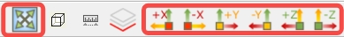
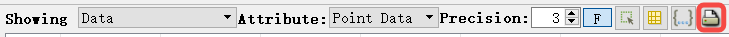
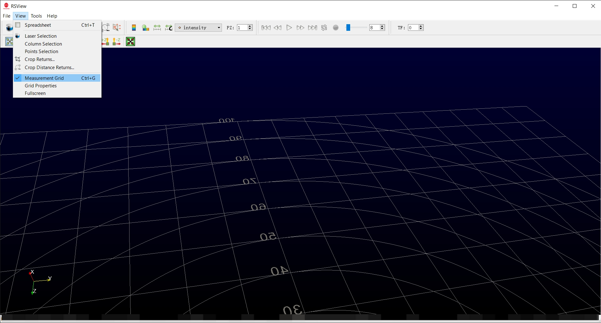
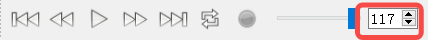

# 点云交互

本节介绍如何在 RSView 中与点云数据进行交互，包括导航、选择和可视化控制。

---

## 导航控制

RSView 支持使用鼠标操作进行标准的 3D 导航。

### 旋转视图
- **鼠标左键 + 拖动**
- 在 3D 空间中旋转点云

### 平移视图
- **鼠标中键（滚轮）+ 拖动**
- 水平和垂直移动场景

### 缩放
- **鼠标滚轮**
- 放大或缩小点云

---

## 视图控制

### 重置视图
使用重置按钮恢复默认的 LiDAR 正向视图。

### 预设视图
RSView 提供了多种预定义视角：

- 前视图
- 顶视图
- 侧视图

这些视图有助于快速从不同角度检查几何结构。

---

## 点选择

你可以使用点选择工具选择点。

### 选择点
- 点击点选择工具
- 鼠标左键 + 拖动以选择部分点云
- 选中的点将被高亮显示

选中的点可以在数据表中进行查看。

---

## 点属性

选择一组点后，你可以点击表格按钮查看点的属性。

每个点包含多个属性，你可以切换各字段的可见性：

- X、Y、Z（位置）
- Intensity（强度）
- Ring（激光通道索引）
- Timestamp（时间戳）

这些属性可用于详细的分析和调试。

---

## 导出选中的点
下面的工具栏项会将当前点云帧保存为 CSV 文件。

打开的对话框如下所示。

点击 OK 并选择 CSV 文件的保存路径。

---

## 可视化设置

### 点大小
调整点大小以提升密集场景中的可见性。

### 颜色模式
RSView 支持多种着色模式：

- Intensity（强度，默认）
- Distance（距离）
- Height（高度，Z 轴）
- Timestamp（时间戳）

切换颜色模式有助于突出不同的空间特征。

---

## 网格显示

提供参考网格以帮助估算尺度和距离。

- 每个网格单元代表一个固定的空间单位
- 可用于物体尺寸估算和场景理解

你可以在以下位置切换网格：
View → Measurement Grid

---
## PCAP 文件回放
打开 PCAP 文件时，RSView 会遍历文件以查找所有帧。当你将滑块拖动到最右端时，右侧的组合框会显示帧数，下图中的文件共有 117 帧。

