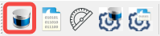
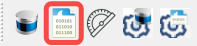
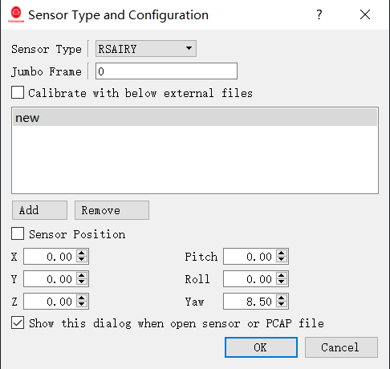
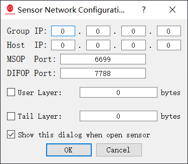

# 快速开始

RSView 是一款用于 RoboSense LiDAR 点云数据的可视化与分析工具。它同时支持在线 LiDAR 设备和离线 PCAP 文件回放。

## 前置条件

在查看点云数据之前，请确保：

* 已安装 RSView
* LiDAR 已上电并已连接到网络
* PC 网络配置与 LiDAR 所在网段一致
---

## 步骤 1：选择数据源

### 打开在线 LiDAR

点击 **Open Sensor** 连接到实时 LiDAR。

### 打开 PCAP 文件

点击 **Open PCAP File** 并选择已录制的文件。

---

## 步骤 2：选择 LiDAR 类型

1. 点击 **File → Sensor Type and Configuration**
2. 从 **Sensor Type** 下拉列表中选择 LiDAR 型号
3. 可选择加载外部标定文件

---

## 步骤 3：配置网络选项

### 在线 LiDAR

配置：

* MSOP Port
* DIFOP Port
* Host IP（用于组播模式）
* Group IP（用于组播模式）

### PCAP 文件

对于离线 PCAP 回放：

* 当文件仅包含单个 LiDAR 的数据时，将端口保持为 0
* 当同一 PCAP 文件中存在多个 LiDAR 数据流时，需指定端口

