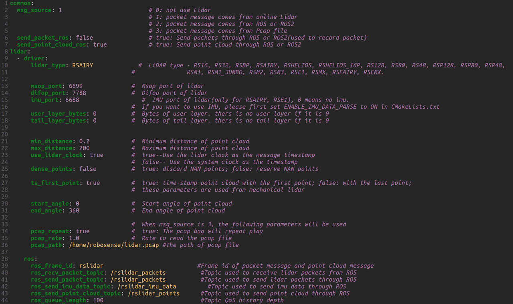

# 配置指南

本节介绍 SDK 的配置方式，以及在何处查找详细的参数参考和进阶用法文档。

---

## 基础参数

SDK 通过位于 `src/rslidar_sdk/config/config.yaml` 的 `config.yaml` 文件进行配置。

以 SDK 1.5.19 版本的 `config.yaml` 文件为例（**图 2.1**），在线连接 Airy 激光雷达时的默认参数配置如下。

*图 2.1 —— 常用参数及介绍*

除上述参数外，SDK 软件包还包含可编辑的**进阶参数**。用户可在软件包内的 `rslidar_sdk/doc/intro` 路径中获取基础参数和进阶参数的详细说明。

---

## 进阶用法

在 SDK 的各种实际应用场景中，可能需要加载离线 PCAP 文件或连接多台激光雷达等进阶操作。为方便使用，SDK 软件包提供了相关文档以供参考。详见 **表 2.1**。

### 表 2.1 —— SDK 的常见进阶用法

| 进阶用法 | GitHub 链接 |
| --- | --- |
| 如何更改点类型 | [05_how_to_change_point_type.md](https://github.com/RoboSense-LiDAR/rslidar_sdk/blob/main/doc/howto/05_how_to_change_point_type.md) |
| 如何解码在线激光雷达 | [06_how_to_decode_online_lidar.md](https://github.com/RoboSense-LiDAR/rslidar_sdk/blob/main/doc/howto/06_how_to_decode_online_lidar.md) |
| 在线激光雷达 —— 进阶主题（例如多台激光雷达） | [07_online_lidar_advanced_topics.md](https://github.com/RoboSense-LiDAR/rslidar_sdk/blob/main/doc/howto/07_online_lidar_advanced_topics.md) |
| 如何解码 PCAP 文件 | [08_how_to_decode_pcap_file.md](https://github.com/RoboSense-LiDAR/rslidar_sdk/blob/main/doc/howto/08_how_to_decode_pcap_file.md) |
| PCAP 文件 —— 进阶主题 | [09_pcap_file_advanced_topics.md](https://github.com/RoboSense-LiDAR/rslidar_sdk/blob/main/doc/howto/09_pcap_file_advanced_topics.md) |
| 如何使用坐标变换 | [10_how_to_use_coordinate_transformation.md](https://github.com/RoboSense-LiDAR/rslidar_sdk/blob/main/doc/howto/10_how_to_use_coordinate_transformation.md) |
| 如何录制和回放 Packet rosbag | [11_how_to_record_replay_packet_rosbag.md](https://github.com/RoboSense-LiDAR/rslidar_sdk/blob/main/doc/howto/11_how_to_record_replay_packet_rosbag.md) |
| 如何解决 ROS2 humble 帧率下降问题 | [13_how_to_solve_ROS2_humble_frame_rate_drop.md](https://github.com/RoboSense-LiDAR/rslidar_sdk/blob/main/doc/howto/13_how_to_solve_ROS2_humble_frame_rate_drop.md) |

除了 SDK 相关文档外，核心驱动 `rs_driver` 也提供了相关的进阶用法和说明。详见 **表 2.2**。

### 表 2.2 —— 驱动的常见进阶用法

| 进阶用法 | GitHub 链接 |
| --- | --- |
| rs_driver CMake 宏简介 | [05_cmake_macros_intro.md](https://github.com/RoboSense-LiDAR/rs_driver/blob/main/doc/intro/05_cmake_macros_intro.md) |
| SDK/驱动常见错误码 | [06_error_code_intro.md](https://github.com/RoboSense-LiDAR/rs_driver/blob/main/doc/intro/06_error_code_intro.md) |
| 如何可视化点云 | [14_how_to_use_rs_driver_viewer.md](https://github.com/RoboSense-LiDAR/rs_driver/blob/main/doc/howto/14_how_to_use_rs_driver_viewer.md) |
| 如何变换点云 | [15_how_to_transform_pointcloud.md](https://github.com/RoboSense-LiDAR/rs_driver/blob/main/doc/howto/15_how_to_transform_pointcloud.md) |
| 如何在 Windows 上编译 rs_driver | [16_how_to_compile_on_windows.md](https://github.com/RoboSense-LiDAR/rs_driver/blob/main/doc/howto/16_how_to_compile_on_windows.md) |
| 如何避免丢包 | [17_how_to_avoid_packet_loss.md](https://github.com/RoboSense-LiDAR/rs_driver/blob/main/doc/howto/17_how_to_avoid_packet_loss.md) |
| 点类型与点布局 | [18_about_point_layout.md](https://github.com/RoboSense-LiDAR/rs_driver/blob/main/doc/howto/18_about_point_layout.md) |
| 分帧规则 | [19_about_splitting_frame.md](https://github.com/RoboSense-LiDAR/rs_driver/blob/main/doc/howto/19_about_splitting_frame.md) |
| CPU 与内存占用 | [20_about_usage_of_cpu_and_memory.md](https://github.com/RoboSense-LiDAR/rs_driver/blob/main/doc/howto/20_about_usage_of_cpu_and_memory.md) |
| 如何解析 DIFOP 数据包 | [21_how_to_parse_difop.md](https://github.com/RoboSense-LiDAR/rs_driver/blob/main/doc/howto/21_how_to_parse_difop.md) |
