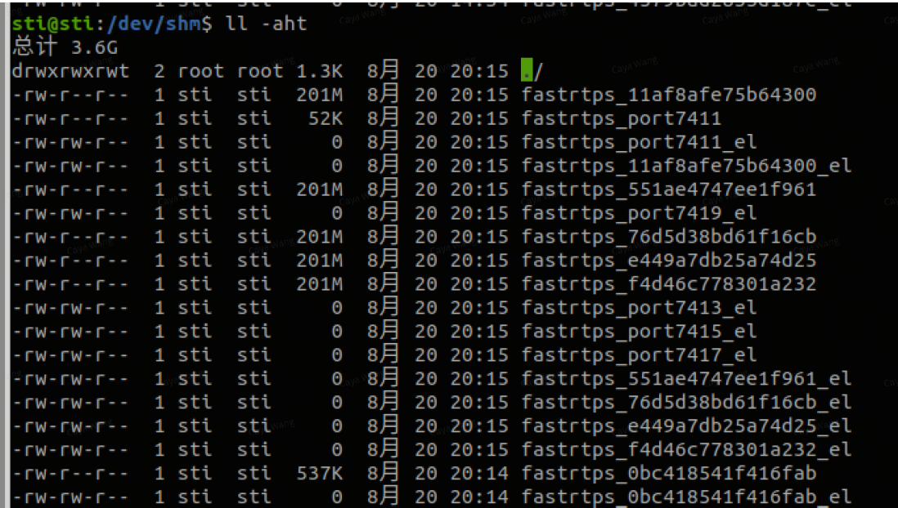
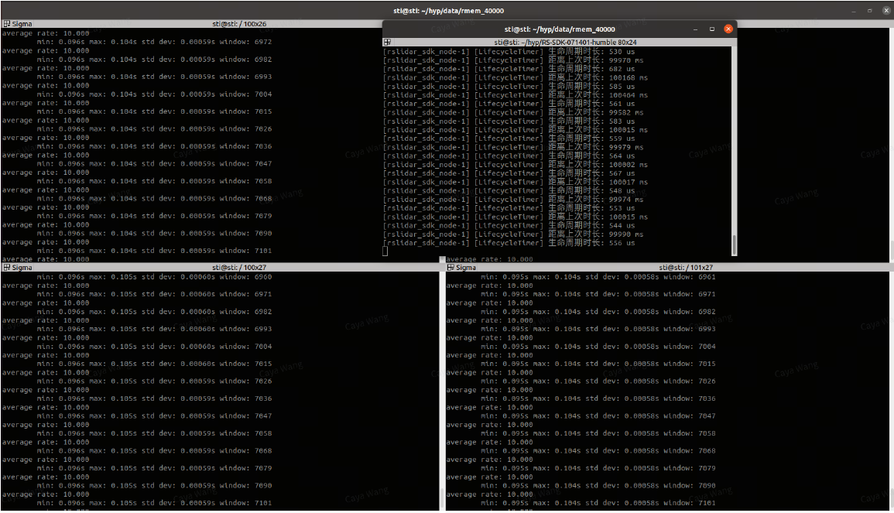

# ROS2 下的 FastDDS 共享内存方案

本次测试在一台运行 Ubuntu 22.04 的计算机上进行，使用 ROS2 Humble 和 FastDDS 作为中间件。

通过 FastDDS 的 XML 配置文件增大共享内存缓冲区大小，经测试后激光雷达的订阅帧率趋于稳定。

## 1. 配置 FastDDS 共享内存 XML 文件

将其保存为 `~/.config/fastdds_shm.xml`：

```xml
<?xml version="1.0" encoding="UTF-8"?>
<profiles xmlns="http://www.eprosima.com/XMLSchemas/fastRTPS_Profiles">
    <participant profile_name="participant_profile_ros2"
is_default_profile="true">
        <rtps>
            <name>profile_for_ros2_context</name>

            <sendSocketBufferSize>104857600</sendSocketBufferSize>
            <listenSocketBufferSize>104857600</listenSocketBufferSize>
        </rtps>
    </participant>
    <data_writer profile_name="default publisher profile"
is_default_profile="true">

        <historyMemoryPolicy>DYNAMIC</historyMemoryPolicy>
    </data_writer>

    <data_reader profile_name="default subscription profile"
is_default_profile="true">

        <historyMemoryPolicy>DYNAMIC</historyMemoryPolicy>
    </data_reader>

    <data_writer profile_name="/rslidar_points">
        <qos>
            <publishMode>
                <kind>ASYNCHRONOUS</kind>
            </publishMode>
            <data_sharing>
                <kind>AUTOMATIC</kind>
            </data_sharing>
        </qos>

        <historyMemoryPolicy>DYNAMIC</historyMemoryPolicy>
    </data_writer>

    <data_reader profile_name="/rslidar_points">
        <qos>
            <data_sharing>
                <kind>AUTOMATIC</kind>
            </data_sharing>

        </qos>
        <historyMemoryPolicy>DYNAMIC</historyMemoryPolicy>
    </data_reader>
</profiles>
```

## 2. 在 ROS2 中通过 XML 发布点云

```shell-session
user@user:~$ export RMW_IMPLEMENTATION=rmw_fastrtps_cpp
user@user:~$ export FASTRTPS_DEFAULT_PROFILES_FILE=~/.config/fastdds_shm.xml
user@user:~$ export RMW_FASTRTPS_USE_QOS_FROM_XML=1
user@user:~$ source install/setup.bash
user@user:~$ ros2 launch rslidar_sdk start.py
```

需要确保已安装 FastDDS。命令如下：

```bash
sudo apt install ros-humble-rmw-fastrtps-cpp
```

## 3. 启动订阅者节点

```bash
ros2 topic hz /rslidar_points
```

## 4. 验证共享内存大小是否生效



其中，201M 是我们设置的共享内存大小，此时帧率基本稳定在 10 Hz。


