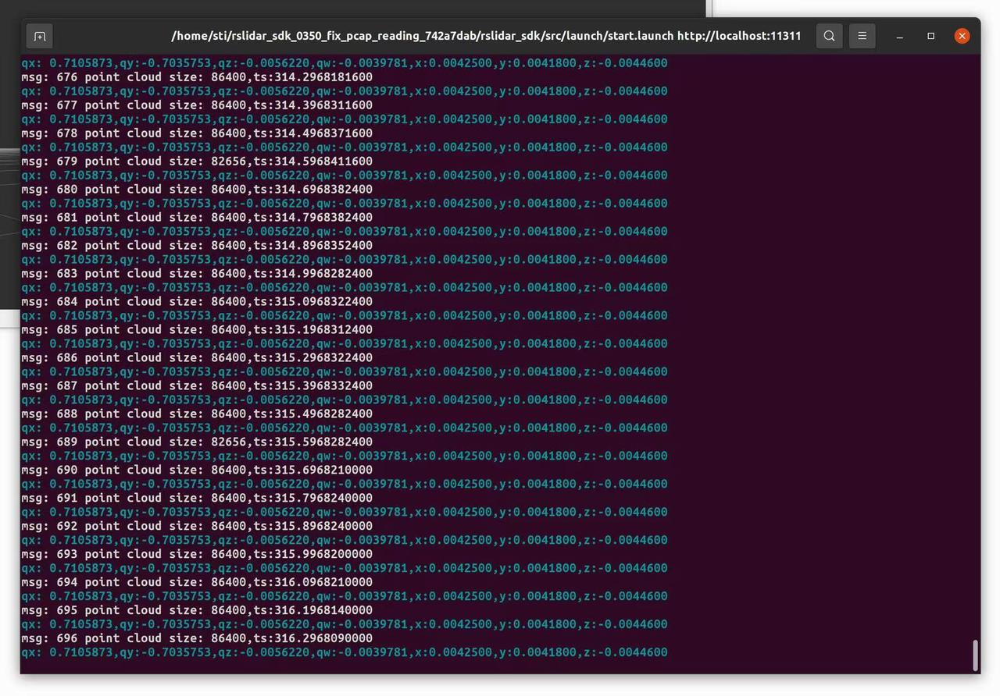
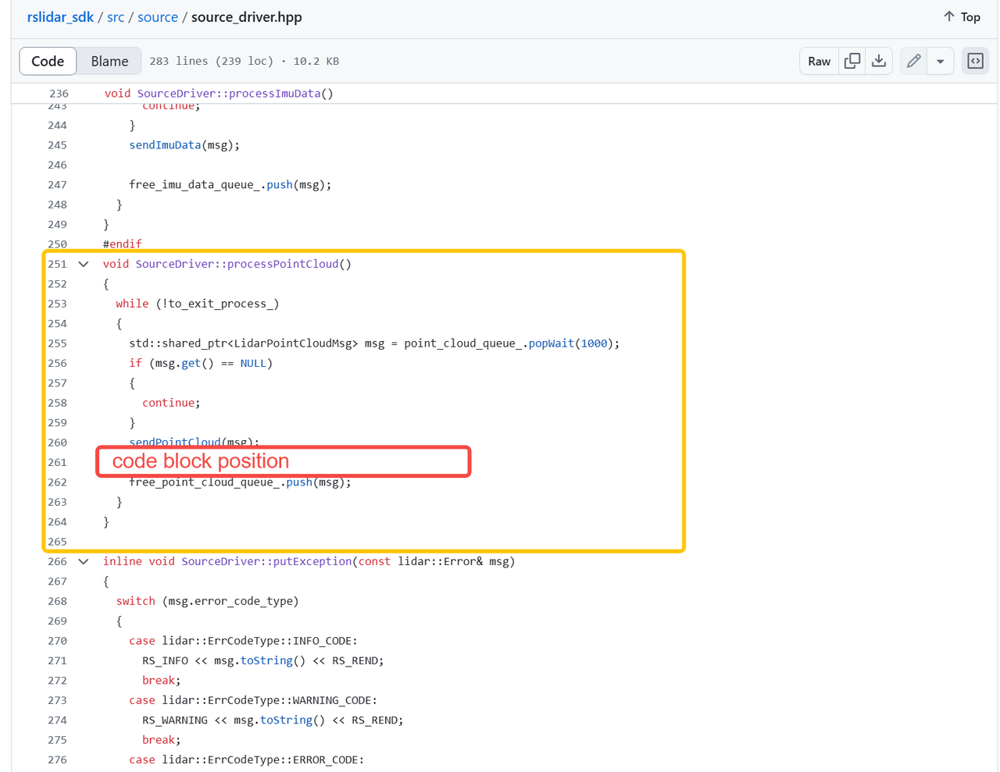

# IMU 外参说明

## 从 rslidar_sdk 直接读取（暂时仅适用于 Airy/Fairy）

- 当驱动运行时，下面被注释掉的代码块能够在终端中打印 Airy/Fairy IMU 外参的四元数。
- 取消注释这部分代码后，用户需要重新 make/rebuild 驱动才能使其生效。


- 这将在终端中打印 qx、qy、qz、qw 四元数以及 xyz。



- 如果所有值都返回 0，则表示该激光雷达设备尚未注册 IMU 参数（早期样机）。遇到此情况请联系 RoboSense。
- 四元数对应 `extrinsic_Q`，而 xyz 对应 `extrinsic_T`。要使四元数生效，`extrinsic_R` 需要全部为 0。在 SLAM 算法的 `.yaml` 文件中，它们应类似于：

```yaml
extrinsic_Q: [qx,qy,qz,qw]      # quaternions - qx,qy,qz,qw (effect w/o rotation matrix)
extrinsic_T: [x,y,z]            # translation matrix
extrinsic_R: [0,0,0,            # rotation matrix
              0,0,0,
              0,0,0]
```

在 RoboSense rslidar_sdk [**release v1.5.19**](https://github.com/RoboSense-LiDAR/rslidar_sdk/releases/tag/v1.5.17) 中，由于这仅是开发者代码，该代码块已被移除。

因此我们在此附上代码，方便用户直接复制粘贴：

```cpp
//   DeviceInfo deviceInfo;
  //   if(driver_ptr_->getDeviceInfo(deviceInfo))
  // {
  //   RS_DEBUG << "qx: " <<  std::fixed << std::setprecision(7)  << deviceInfo.qx  << ",qy:" << deviceInfo.qy << ",qz:" << deviceInfo.qz << ",qw:" << deviceInfo.qw  << ",x:" << deviceInfo.x << ",y:" << deviceInfo.y << ",z:" << deviceInfo.z << std::endl;
  // }else{
  //   RS_WARNING << "get device info failed" << RS_REND;
  // }
```



## 附加信息

1. 如果用户更倾向于使用传统的 `extrinsic_T` 和 `extrinsic_R` 而非四元数，请使用适当的转换工具。

2. **为什么激光雷达静止时角速度（angular_velocity）值不为 0？**

    **答：** 由于温度、噪声、安装误差乃至地球自转的影响，IMU 在静止时会产生一定的角速度，因此我们会对零偏误差进行补偿，我们的算法会自动进行校正以保证 IMU 数据的准确性。该值目前非零，但非常接近 0，因为仍存在一些无法完全校正的未知微小噪声，因此该值只能接近 0，而无法使所有角速度值都恰好等于 0。

3. **为什么激光雷达静止时 imu 的 z 值较大（约 -10 ~ -9）？**

    **答：** 静止时，IMU 加速度等于重力加速度。实际上，加速度计测量的是物体自身的加速度，其静止时输出的本质是抵消重力所需的等效加速度（方向沿支撑力方向）。由于力的方向和地球纬度的影响，它并不恰好等于 9.8。
